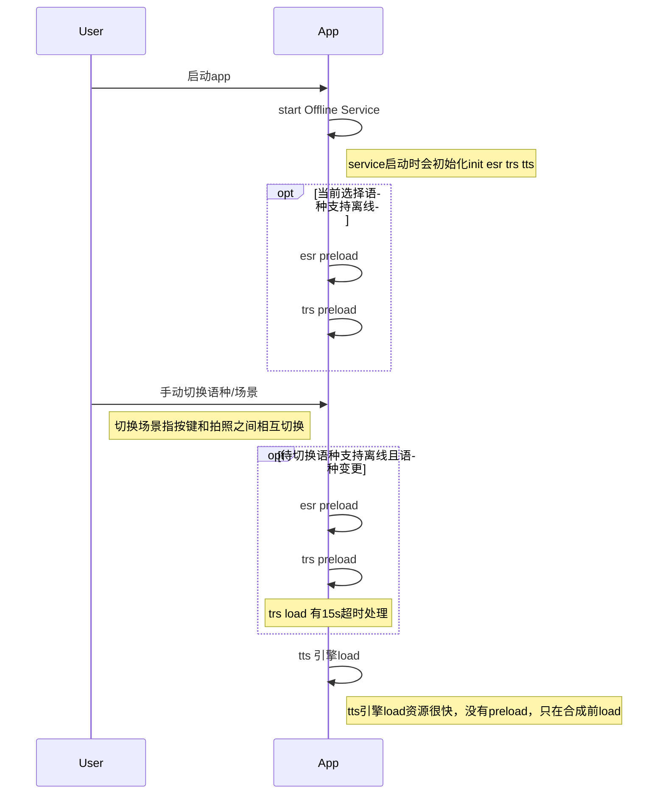
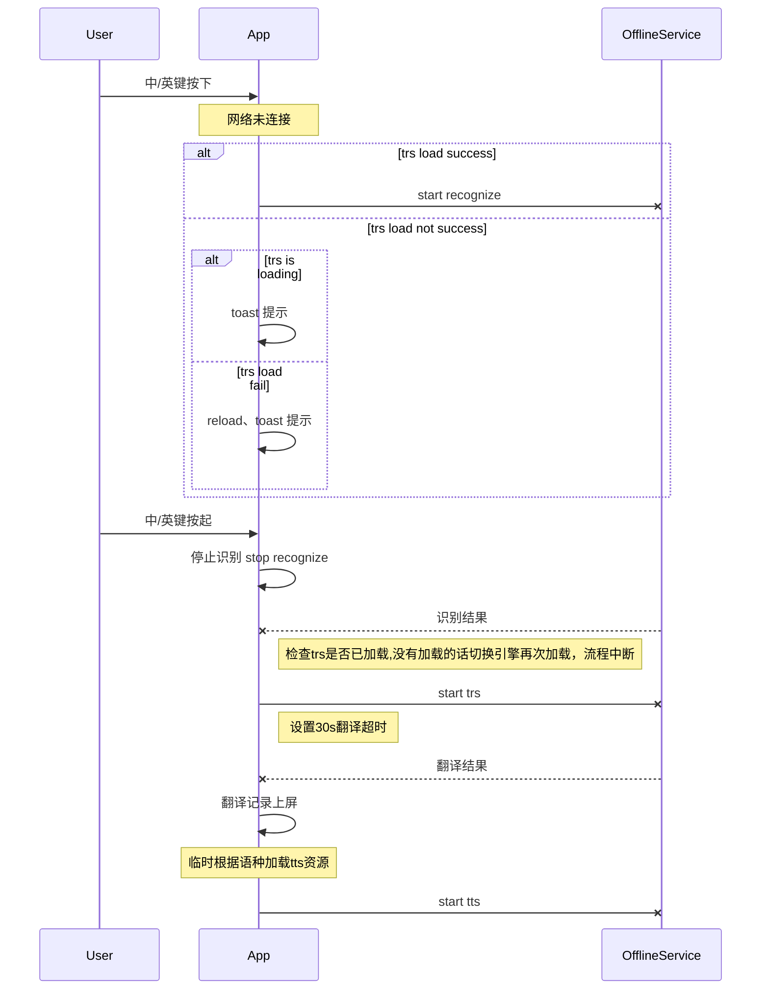

# 8113版本项目总结  #  

|  日期  | 版本  | 说明  | 作者  
|--|--|--|--|
|  2018/8/14| V1.0 | 项目总结|韦章翔
  
# 1. 总览 #  
  
### 1.1 背景介绍 ###  
晓译翻译机2代8113版本发布期间，整个版本质量比较差，交付能力较前版本明显减弱。具体表现：交付延时，bug反复打回，性能问题严重，代码提交松散。
  
# 2. 总结 #

# 组件图

## 时序图

 1. 语种切换

 2. 按键翻译

3. esr trs load unload 实现
通过handler维护队列，如果队列中存在未执行的load或start 任务，则直接移除；
添加最新的任务，保障频繁切换语种情况下，不需要排队等待。

## 离线翻译Tag 
 
 - EsrEngine/QRecognizeEngine
 - TransEngine/QTranslateEngine
 - FlyTtsWrapper （中英）/QTtsEngine
 - RusTtsWrapper （俄，日，韩）/QTtsEngine

## 离线翻译资源地址
**esr** 
> /sdcard/esr/*

**trs**  
> /sdcard/itrans_db3300
> /sdcard/NiuTransTransformer

**tts**
>  /sdcard/tts/*

## 离线翻译log地址

>中英： /data/data/com.iflytek.android.device/files/log_cnen.log
俄日韩： /data/data/com.iflytek.android.device/files/log_ru.log

<!--stackedit_data:
eyJoaXN0b3J5IjpbNDczNDYzODM3XX0=
-->