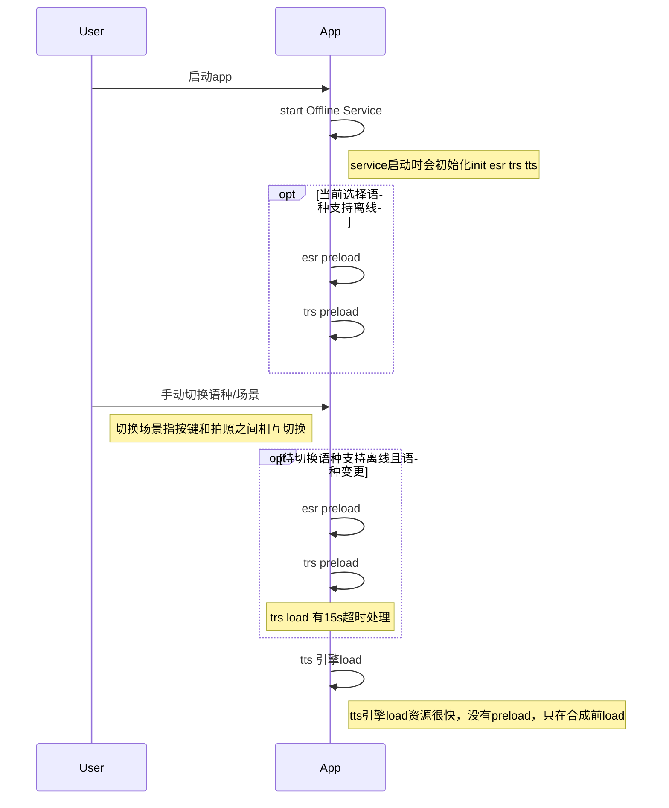
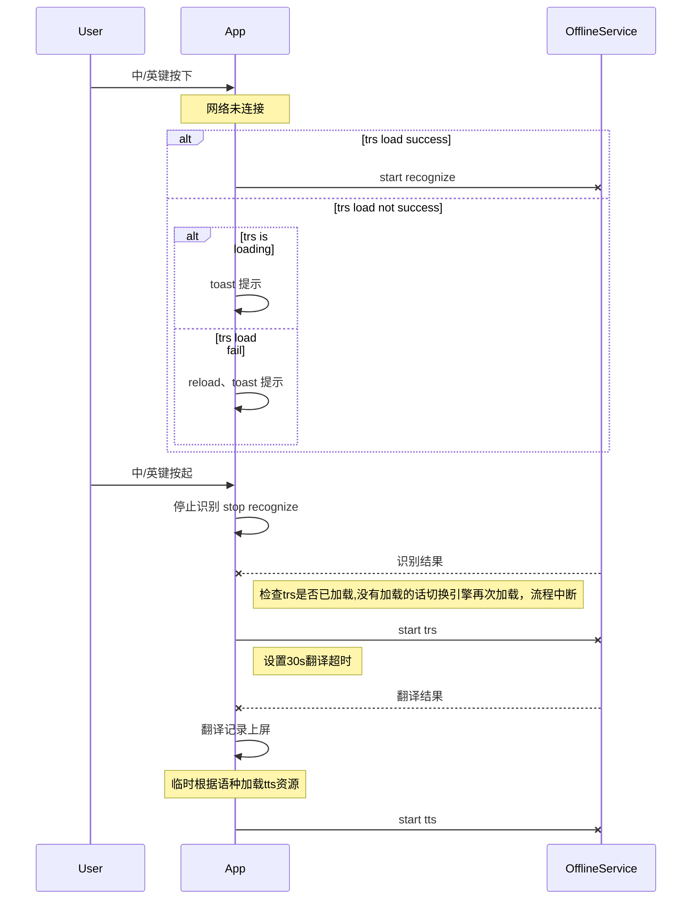

# 离线翻译详细设计 #  

|  日期  | 版本  | 说明  | 作者  
|--|--|--|--|
|  2018/7/3| V1.0 | 离线翻译设计评审|韦章翔
  
# 1. 总览 #  
  
### 1.1 背景介绍 ###  
晓译翻译机2代在英、俄离线的基础上，增加了日、韩离线语种。  
目前仅支持中到英、日、韩方向的互译。目的在于给测试人员更
深入的理解离线翻译的实现 。
  
  
### 1.2 适用范围 ###  
本文档不设范围  
  
### 1.3 定义、首字母缩写词和缩略语 ###  
- **ESR** 识别引擎  
- **TRS** 翻译引擎  
- **TTS** 合成引擎  
  
# 2. 详细设计 #

# 组件图

## 时序图

 1. 语种切换

 2. 按键翻译

3. esr trs load unload 实现
通过handler维护队列，如果队列中存在未执行的load或start 任务，则直接移除；
添加最新的任务，保障频繁切换语种情况下，不需要排队等待。

## 离线翻译Tag 
 
 - EsrEngine/QRecognizeEngine
 - TransEngine/QTranslateEngine
 - FlyTtsWrapper （中英）/QTtsEngine
 - RusTtsWrapper （俄，日，韩）/QTtsEngine

## 离线翻译资源地址
**esr** 
> /sdcard/esr/*

**trs**  
> /sdcard/itrans_db3300
> /sdcard/NiuTransTransformer

**tts**
>  /sdcard/tts/*

## 离线翻译log地址

>中英： /data/data/com.iflytek.android.device/files/log_cnen.log
俄日韩： /data/data/com.iflytek.android.device/files/log_ru.log

<!--stackedit_data:
eyJoaXN0b3J5IjpbLTM4MzQwNzE4MF19
-->